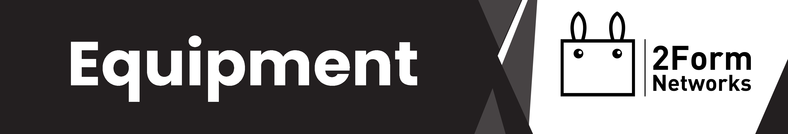

# Kurylo's Equipment List
(Last Updated: September 2023)

## PC Setup
    CPU: Ryzen 7 2700x (8 x 3.7 GHz)
    GPU: AMD Radeon 8GB XFX 6600 XT
    RAM: 32 GB (2 x 16) DDR4 Corsair 3600 MHz
    SSD: 1TB Gigabyte AORUS Gen4 7000s PCIe 4.0

    Motherboard: MSI B450 GAMING PLUS MAX
    Cooling System: be quiet! Dark Rock Pro 4
    PSU: Corsair RM850 Modular 80+ Gold 850 Watt 
    Case: Sharkoon TG5
#### Shopping List (Upgrading Soon?): 
    CPU: AMD Ryzen 9 7900X (12x 4.70 GHz)
    RAM: 64 GB (4 x 16) DDR5 Corsair 6400 MHz

    Motherboard: MSI MEG X670E ACE
    Cooling System: MSI MPG CoreLiquid K240 
### Monitors
    MSI Optix MAG271CR 144 Hz 27"
    LC-M24-FHD-144-C-V2 144 Hz 24"
    Samsung C24F390 60 Hz 24"
#### Shopping List (Upgrading Soon?): 
    BenQ ZOWIE XL2566K 360 Hz 24.5" 
    BenQ EW3270U 60 Hz 32" 
    BenQ EW3270U 60 Hz 32"
## Audio Setup
    Microphone: Røde NT1A
    Microphone Arm: Røde PSA1

    Audio Interface: YAMAHA AG03
    MIDI: Nektar Impact LX61+
#### Shopping List (Upgrading Soon?): 
    Audio Interface: Rode RodeCaster Duo 
    Audio Interface: Yamaha AG08 

    Microphone: Shure SM7B
    Microphone Arm: Røde PSA1+ Pro
    
    MIDI: Nektar ARUBA MIDI-Pad
    Piano: Yamaha CLP-785 PE

    ...
#### Headphones: 
    Beyerdynamic DT900 Pro X (Main)
    Beyerdynamic DT770

    Audio Technica ATH-M40x
    SteelSeries Arctis 1
    Sony MDR-7506
### Laptop Workstation: 
    Model: HP ZBook Fury 16 G9
    Display: 120 Hz 16"

    CPU: Intel i9.12950HX (8x 2.30 GHz + 8x 1.70 GHz E-Core)
    GPU: NVIDIA RTX A3000 12GB GDDR6
    RAM: 32 GB (2 x 16) DDR5 4800 MHz

### Server: 
    CPU: Ryzen 7 3800x (8 x 3.9 GHz)
    RAM: 32 GB (2 x 16) DDR4 Patriot Viper 3600 MHz
    SSD: 1TB Patriot Viper VPN100 M.2 2280 PCIe 3.0
    HDD: 16TB Seagate Exos X X16 ST16000NM001G

    Motherboard: Gigabyte B550I Aorus Pro
    Cooling System: be quiet! Pure Loop 120mm All-in-One
    PSU: be quiet! Straight Power 11 Modular 80+ Platinum 550 Watt
    Case: PHANTEKS Evolv Shift 2 Mini-ITX

### Phone: 
    Primary: Samsung Galaxy ZFold 3 
    Secondary: Samsung Galaxy Note 10 Lite

### Notes (Coming Soon):
 - Server will be rebuilt and coupled with a NAS system
 - Audio setup will include monitor speakers, however undecided which
 - A secondary PC setup will be built; specific specifications are undecided
